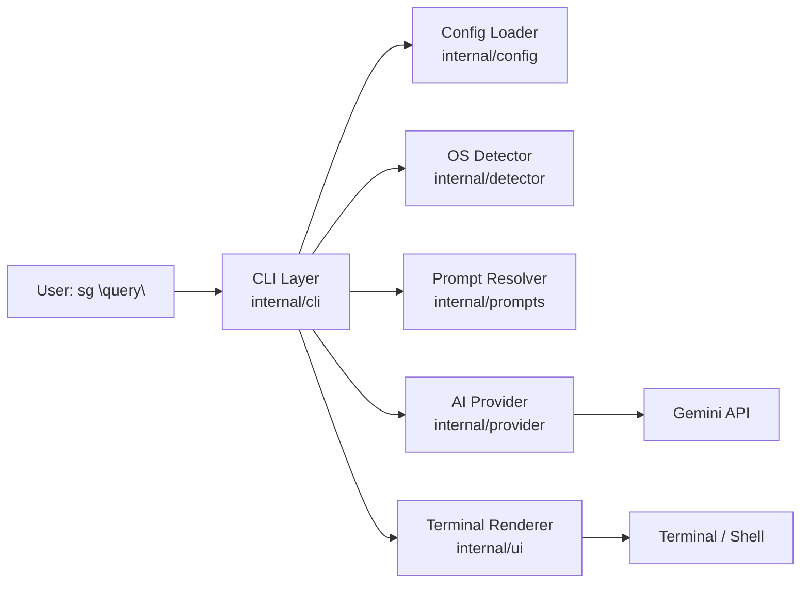

# ShellSage CLI (sg)

A small AI-powered CLI utility that translates natural language shell command requests into executable commands for macOS, Linux, and Windows.

This repository contains the `myproject/` implementation of ShellSage, a Golang CLI that:
- accepts a plain-English command request
- uses an AI provider to generate OS-specific shell commands
- displays command variants for macOS/Linux/Windows
- classifies risk and optionally runs the selected command

> The current implementation resolves provider configuration from `~/.shellsage/config.toml` and environment variables.

## Architecture



### Component responsibilities

- `cmd/main.go` - application entry point; creates cancellation context and executes the CLI.
- `internal/cli` - Cobra commands, flag parsing, `sg` runtime flow, config overrides.
- `internal/config` - loads settings from defaults, `~/.shellsage/config.toml`, and environment variables.
- `internal/detector` - detects current OS and shell, and supports `--os` overrides.
- `internal/prompts` - provides bundled system prompt text and optional user override.
- `internal/provider` - sends requests to the AI provider and parses JSON response.
- `internal/ui` - prints variants, risk banners, confirmation prompts, and executes commands.
- `internal/risk` - classifies command risk (`low`, `medium`, `high`).

## Supported commands

### `sg "query"`

Translate a natural language request into a shell command.

Example:
```bash
./dist/sg "list open ports"
```

### `sg config init`

Run the interactive setup wizard and write configuration to `~/.shellsage/config.toml`.

### `sg config show`

Print the resolved configuration with redacted API key.

### `sg version`

Show build metadata and version information.

## Flags

Root command flags apply to `sg "query"`:

- `--run` - execute the generated command immediately after confirmation.
- `--dry` - display generated commands only; never execute.
- `--os <macos|linux|windows>` - override OS detection.
- `--provider <claude|openai|ollama|gemini>` - override configured provider.
- `--model <model-name>` - override configured model name.
  - example: `sg --provider openai --model gpt-4o-mini "your query"`
  - or `sg --provider claude --model claude-sonnet-4-20250514 "your query"`
- `--no-color` - disable styled/colored terminal output.

## Configuration

### Default config file

ShellSage stores config under:

```text
~/.shellsage/config.toml
```

### Default config layout

```toml
[provider]
  name     = "gemini"
  model    = "gemini-2.5-flash"
  api_key  = ""
  base_url = ""

[behavior]
  default_mode  = "dry"
  confirm_risky = true
  os_override   = ""
  no_color      = false

[prompt]
  override_path = ""
```

### Environment variables

The CLI resolves keys in this order:
1. provider-specific env var for selected provider
   - `GEMINI_API_KEY`
   - `OPENAI_API_KEY`
   - `ANTHROPIC_API_KEY`
2. fallback `SHELLSAGE_API_KEY`
3. config file value

Also supported:
- `SHELLSAGE_PROVIDER`
- `NO_COLOR` (forces plain text output)

### Prompt override

If `prompt.override_path` is set or `~/.shellsage/prompts/system.txt` exists, that prompt replaces the embedded default system prompt.

## Input / Output behavior

### Input

The CLI expects a single positional natural language query argument:

```bash
sg "delete all node_modules folders recursively"
```

### Output

The output includes:
- a command variant table for macOS, Linux, and Windows
- a risk banner when the detected OS command is medium or high risk
- an interactive confirmation flow before execution

If a command variant is selected for execution, ShellSage uses the detected/overridden OS and shell to choose the primary command.

## Execution flow

1. `internal/cli` loads configuration.
2. CLI applies flag overrides.
3. OS and shell are detected in `internal/detector`.
4. The system prompt is resolved from embedded prompt or override file.
5. `internal/provider` sends the query to Gemini and parses the AI result.
6. `internal/ui` displays variants, risk state, and prompts the user.
7. If confirmed and not dry-run, the selected command is executed.

## Provider support

The code is structured to support multiple providers, and the provider factory now wires all implemented backends.

Supported providers:
- `gemini`
- `openai`
- `claude`
- `ollama`

Model selection
- Override the model with `--model <model-name>`.
- Set `provider.model` in `~/.shellsage/config.toml` to make the change permanent.
- Provider defaults:
  - Gemini: `gemini-2.5-flash`
  - OpenAI: `gpt-4o`
  - Claude: `claude-sonnet-4-20250514`
  - Ollama: `llama3`

The config wizard prompts for these providers, and the provider factory in `myproject/internal/provider/provider.go` now constructs the correct implementation for each one.

## Build and run

### Requirements

- Go 1.26+

### Build

From `myproject/`:

```bash
cd myproject
make build
```

### Install as a Go tool

If the repository is published and accessible, users can install the CLI directly with Go:

```bash
go install github.com/RituGupta23/ShellSage/cmd@latest
```

If they have the repository locally, they can install from the source tree:

```bash
go install ./cmd
```

After installation, the `sg` binary is available in `$GOBIN` or `$GOPATH/bin`.

### Release downloads

When you publish a GitHub release, this project will automatically build release binaries for:
- `linux/amd64`
- `darwin/amd64`
- `darwin/arm64`
- `windows/amd64`

Users can download the matching binary from the GitHub Releases page without needing `go install`.

> Note: make sure your public repo path matches the module path in `go.mod`.

### Use as a Go library

This repository now exposes a public library wrapper in `pkg/shellsage`.

Example:

```go
package main

import (
    "context"
    "fmt"

    "github.com/RituGupta23/ShellSage/pkg/shellsage"
)

func main() {
    cfg, err := shellsage.LoadConfig()
    if err != nil {
        panic(err)
    }

    resp, err := shellsage.RunQuery(context.Background(), cfg, "list all .env files")
    if err != nil {
        panic(err)
    }

    fmt.Printf("Result: %+v\n", resp)
}
```

The library uses the same config rules as the CLI, including:
- `~/.shellsage/config.toml`
- provider-specific env vars: `GEMINI_API_KEY`, `OPENAI_API_KEY`, `ANTHROPIC_API_KEY`
- fallback `SHELLSAGE_API_KEY`
- `provider.base_url` for Ollama

This lets the project be used as both a CLI and an importable module.

Binary output:

```bash
./dist/sg
```

### Install

```bash
cd myproject
make install
```

### Run directly

```bash
cd myproject
go run ./cmd -- "list open ports"
```

### Run tests

```bash
cd myproject
make test
```

### Clean artifacts

```bash
cd myproject
make clean
```

## Example usage

```bash
cd myproject
./dist/sg "show me all open ports"